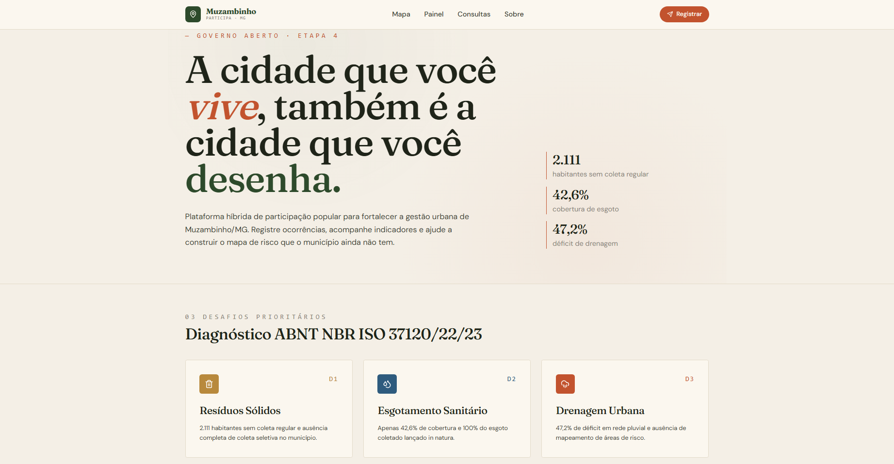
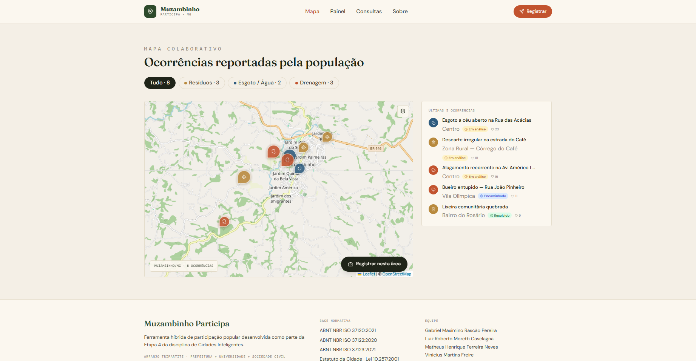
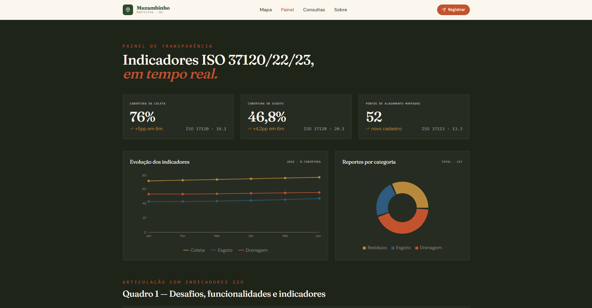
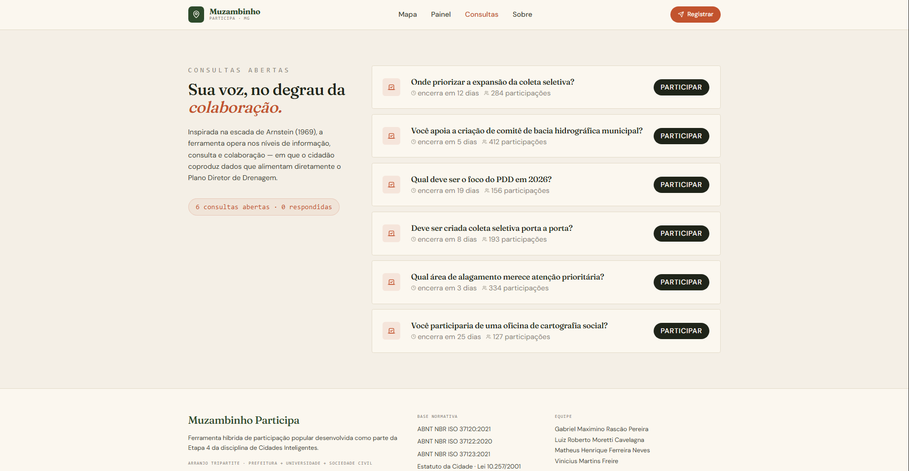

# Muzambinho Participa

Ferramenta híbrida de participação popular para fortalecer a gestão urbana de Muzambinho/MG. A plataforma permite que cidadãos registrem ocorrências de saneamento e drenagem, acompanhem indicadores ISO e participem de consultas públicas que alimentam o Plano Diretor de Drenagem.

## Screenshots

| Home | Mapa Colaborativo |
|------|-------------------|
|  |  |

| Painel ISO | Consultas Públicas |
|------------|-------------------|
|  |  |

## Contexto Acadêmico

Projeto desenvolvido como **Etapa 4** da disciplina de **Cidades Inteligentes** da **PUC Minas — Campus Poços de Caldas**, com base no diagnóstico levantado na Etapa 3 (ABNT NBR ISO 37120/37122/37123). O MVP demonstra um arranjo tripartite — Prefeitura + Universidade + Sociedade Civil — nos níveis de informação, consulta e colaboração da escada de Arnstein (1969).

## Os 3 Desafios Prioritários

| Código | Desafio | Indicador Principal |
|--------|---------|---------------------|
| **D1** | **Resíduos Sólidos** — 2.111 habitantes sem coleta regular e ausência de coleta seletiva | ISO 37120:16.1 — Cobertura de coleta (76%) |
| **D2** | **Esgotamento Sanitário** — apenas 42,6% de cobertura e 100% do esgoto lançado in natura | ISO 37120:20.1 — Cobertura de esgoto (46,8%) |
| **D3** | **Drenagem Urbana** — 47,2% de déficit em rede pluvial e ausência de mapa de risco | ISO 37123:13.3 — Pontos de alagamento mapeados (52) |

## Funcionalidades

| Funcionalidade | Descrição |
|---|---|
| **Mapa colaborativo** | Pins georreferenciados por categoria (D1/D2/D3), filtro por tipo, flyTo animado ao clicar |
| **Heatmap de ocorrências** | Toggle Layers alterna entre pins e mapa de calor (leaflet.heat), intensidade proporcional aos apoios |
| **Registro de ocorrências** | Formulário com geolocalização, confetti + toast de confirmação, persistência em localStorage |
| **Sistema de apoio** | Botão "Apoiar ocorrência" com contador, anti-duplo-apoio por localStorage, ordenação por popularidade |
| **Timeline de histórico** | Cada ocorrência exibe linha do tempo com eventos (registro, apoios, encaminhamento, resolução) |
| **Painel ISO** | KPIs animados (count-up), gráfico de evolução temporal, pizza por categoria, exportação CSV |
| **Progresso dos desafios** | Barras animadas D1/D2/D3 com valores dinâmicos (contagem real de ocorrências + base fixa) |
| **Consultas públicas** | Votação com rádio customizado, resultados em tempo real, persistência localStorage |
| **Minha participação** | Painel anônimo (sem login) com contadores de ocorrências, apoios e votos dados neste navegador |
| **Escada de Arnstein** | Visualização interativa dos 8 degraus, destacando os níveis em que a plataforma opera |
| **Animações** | `whileInView` + stagger (motion.dev), count-up nos KPIs via IntersectionObserver + rAF |

## Stack

| Tecnologia | Versão | Papel |
|---|---|---|
| Vite | 6.x | Bundler + dev server |
| React | 18.x | UI framework |
| TypeScript | 5.x | Tipagem estática (strict) |
| Tailwind CSS | 4.x | Utilitários CSS + `@theme` customizado |
| react-router-dom | 7.x | Roteamento SPA |
| react-leaflet + leaflet | 5.x / 1.9.x | Mapa colaborativo |
| leaflet.heat | latest | Heatmap de concentração de ocorrências |
| recharts | 3.x | Gráficos (LineChart, PieChart) |
| motion | 11.x | Animações de entrada (`whileInView`, stagger) |
| sonner | latest | Toast notifications |
| canvas-confetti | latest | Burst de confetti ao registrar ocorrência |
| lucide-react | latest | Ícones |
| Fraunces + DM Sans + Poppins | latest | Fontes (display + corpo + títulos especiais) |

## Decisões Arquiteturais

### Mocks como Services (drop-in para Supabase)

Toda a camada de dados está encapsulada em `src/mocks/`. As funções retornam `Promise<T>` com latência simulada (200–500ms) e persistência via `localStorage`, imitando exatamente o contrato de uma API real.

```
src/mocks/
├── index.ts          → getOccurrences(), createOccurrence(), supportOccurrence()
│                        getSupportedIds(), getMyOccurrenceIds(), getChallengeProgress()
│                        getIndicators(), getIndicatorEvolution(), getReportsByCategory()
└── consultations.ts  → getConsultations(), saveVote(), getVotes()
```

Para migrar para Supabase em produção, basta substituir cada função por uma chamada `supabase.from(...)` — **nenhum componente precisa mudar**.

### Inline Styles + Palette

A paleta de cores é mantida em `src/lib/palette.ts` como constantes JavaScript, exportada como objeto `palette`. Isso permite usar os tokens diretamente em `style={{}}` preservando type-safety e evitando conflitos com classes CSS dinâmicas.

### Animações Progressivas

Todas as animações usam `whileInView` + `viewport={{ once: true }}` (motion.dev), garantindo que cada seção anima apenas na primeira vez que entra na tela — sem replay ao scrollar de volta.

## Pré-requisitos

- Node.js 18+
- npm 9+

## Execução local

```bash
git clone https://github.com/Gmaxpereira/muzambinho-participa.git
cd muzambinho-participa
npm install
npm run dev
```

A aplicação estará disponível em `http://localhost:5173`.

## Build de produção

```bash
npm run build   # gera dist/
npm run preview # serve o build localmente
```

## Estrutura de Pastas

```
src/
├── components/        # Reutilizáveis: Header (com "Minha participação"), Footer, Layout
│   └── ui/            # Skeleton
├── contexts/          # RegisterOccurrenceContext — dialog global + confetti/toast
├── pages/             # Home, Mapa, Painel, Consultas, Sobre, NotFound
├── features/          # MapView (heatmap), OccurrenceDetail (timeline), OccurrenceRow,
│                      # ChallengeProgressSection, MyParticipationPanel, VoteDialog,
│                      # ArnsteinLadder, KPICard, ISOTable, Stat…
├── hooks/             # useCountUp — animação count-up com IntersectionObserver
├── mocks/             # Serviços async com localStorage (substituível por Supabase)
├── types/             # index.ts — interfaces TypeScript (Occurrence, TimelineEvent…)
├── lib/               # utils.ts (cn), palette.ts (tokens de cor)
└── styles/            # globals.css — @theme + fontes + keyframes (mp-ring-pulse)
```

## Fluxo de contribuição

```bash
git checkout -b feat/nome-da-tarefa
# realize as mudanças
git add . && git commit -m "feat: descrição curta"
git push -u origin feat/nome-da-tarefa
# abra o PR no GitHub para revisão
```

## Convenção de Commits

| Prefixo | Uso |
|---------|-----|
| `feat:` | Nova funcionalidade |
| `fix:` | Correção de bug |
| `style:` | Alterações visuais / CSS sem mudança de lógica |
| `docs:` | Documentação |
| `refactor:` | Refatoração sem bug fix ou feature |

## Equipe

- Gabriel Maximino Rascão Pereira
- Luiz Roberto Moretti Cavelagna
- Matheus Henrique Ferreira Neves
- Vinicius Martins Freire

**Instituição:** PUC Minas — Campus Poços de Caldas  
**Disciplina:** Cidades Inteligentes — Etapa 4 (2026)

## Licença

MIT © 2026 — Gabriel Maximino Rascão Pereira, Luiz Roberto Moretti Cavelagna, Matheus Henrique Ferreira Neves, Vinicius Martins Freire
